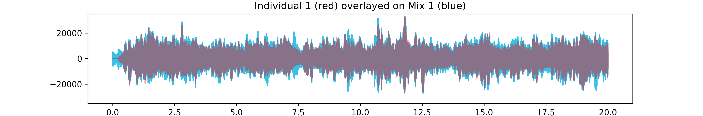
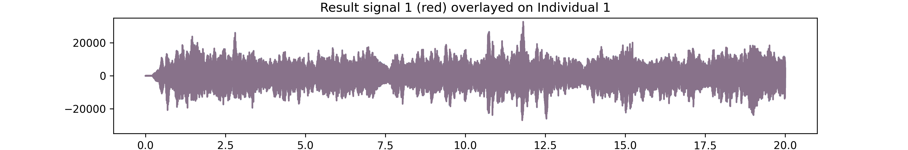

# Overview

This repo contains notebooks working through an example of deconvoluting mixed audio signals using Independent Component Analysis (ICA) in `sklearn`.  It synthetically mixes audio files in [generate_example_mixes.ipynb](generate_example_mixes.ipynb).  It then deconvolutes the mixed signals using ICA and compares them to the original individual audio files in [deconvolute_example_mixes.ipynb](deconvolute_example_mixes.ipynb).  Functions useful for manipulating audio files are included in `wav_utils.py`.


### Before deconvolution


[Mixed audio clip](example-files/mix-clip-01.wav)

### After deconvolution


[Deconvoluted audio clip (cello only)](example-files/deconvoluted-signal-01.wav)

## Related resources

- [Udacity: Introduction to Machine Learning with TensorFlow](https://www.udacity.com/course/intro-to-machine-learning-with-tensorflow-nanodegree--nd230)
    - This notebook is a deeper exploration inspired by an example from Udacity
- [Blind source separation using FastICA](https://scikit-learn.org/stable/auto_examples/decomposition/plot_ica_blind_source_separation.html)
    - Simple example on sklearn

# Setup

```
# set up virtual env with pyenv
pyenv virtualenv 3.11.7 ica-example
pyenv shell ica-example

# clone the repo
git clone git@github.com:mrperkett/ICA-audio-deconvolution.git
cd ICA-audio-deconvolution/

# install requirements
python3 -m pip install requirements.txt

# register IPython kernel
python3 -m ipykernel install --user --name  ica-example
```

Run Jupyter lab, open the notebook you wish to run, and select the `ica-example` kernel to run.